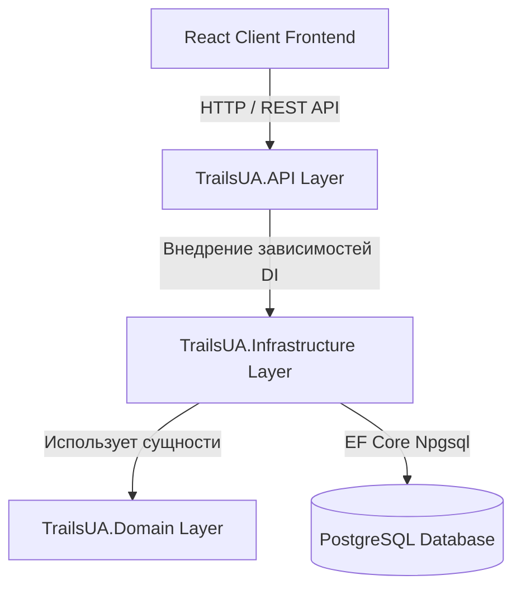

# Архитектура проекта "Trails UA"

> Историческое описание первоначального проекта. Актуальные источники данных,
> бронирования и администрирование описаны в [DEFENSE_GUIDE.md](DEFENSE_GUIDE.md),
> [DATA_SOURCES.md](DATA_SOURCES.md), [BOOKINGS.md](BOOKINGS.md) и [ADMIN.md](ADMIN.md).

## 1. Общий обзор системы

Проект **Trails UA** использует слоистую монолитную архитектуру. Строгая Clean Architecture не соблюдается во всех модулях.

### Технологический стек:
* **Frontend:** React 19, TypeScript 6, Vite 8, React Router 7, Axios.
* **Backend:** C# / .NET 10 Web API, Entity Framework Core 9.
* **Database:** PostgreSQL 16+, запущенная в изоляции через Docker Compose.
* **Security:** JWT (JSON Web Tokens), BCrypt.Net, Google OAuth 2.0, RBAC.

---

## 2. Структура слоёв бэкенда

```mermaid
graph TD
    Client[React Client Frontend] -->|HTTP / REST API| API[TrailsUA.API Layer]
    API -->|Внедрение зависимостей DI| Infra[TrailsUA.Infrastructure Layer]
    Infra -->|Использует сущности| Domain[TrailsUA.Domain Layer]
    Infra -->|EF Core Npgsql| DB[(PostgreSQL Database)]
```

### Назначение слоёв:
1. **`TrailsUA.API` (Слой представления / API):**
   * Контроллеры (`AuthController`, `UserController`, `RoutesController`, `ReviewController`, `AdminController`).
   * Прослойки (`ExceptionHandlingMiddleware`, CORS policies).
   * Конфигурация приложения (`Program.cs`, `appsettings.json`).

2. **`TrailsUA.Infrastructure` (Слой инфраструктуры и бизнес-логики):**
   * Реализация сервисов (`AuthService`, `UserService`, `RouteService`, `ReviewService`).
   * `AppDbContext` (Контекст базы данных Entity Framework Core).
   * Миграции базы данных (`Migrations/`).

3. **`TrailsUA.Domain` (Слой предметной области):**
   * Сущности предметной области (`User`, `Route`, `Category`, `Review`, `Comment`, `Favorite`, `Image`).
   * Объекты передачи данных (`DTOs` для Auth, User, Route, Review).
