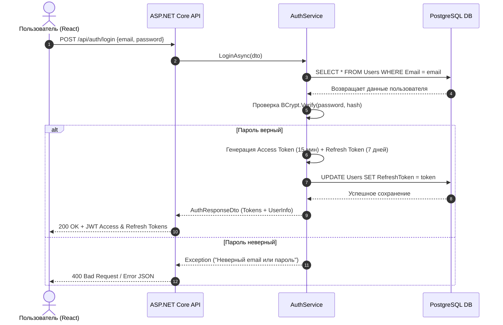

# Механизм авторизации и безопасности

## 1. Ролевая модель (RBAC)

Приложение поддерживает 4 уровня доступа:
* `User (0)` — Орендар / Турист (просмотр маршрутов, бронирование, отзывы).
* `Landlord (1)` — Орендодавець / Гид (создание и удаление собственных маршрутов).
* `Moderator (2)` — Модератор (проверка контента).
* `Admin (3)` — Администратор (полное управление пользователями и ролями).

---

## 2. Диаграмма последовательности входа (JWT & Refresh Token)

