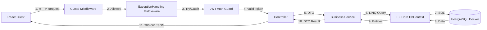

# Жизненный цикл HTTP-запроса (Data Flow)

## Схема прохождения запроса через систему

## Этапы обработки запроса:
1. **CORS Policy:** Проверка домена источника (`http://localhost:5173`).
2. **Global Error Middleware:** Оборачивание всего пайплайна в `try-catch` блок для перехвата необработанных исключений и возврата JSON-ошибок.
3. **Authentication & Authorization Guard:** Валидация JWT токена в заголовке `Authorization: Bearer <token>` и проверка прав ролей (`[Authorize(Roles = "...")]`).
4. **Controller:** Приём DTO, первичная валидация входных данных.
5. **Service Layer:** Выполнение бизнес-логики, проверка прав владения ресурсом, хеширование.
6. **Data Access (EF Core):** Взаимодействие с PostgreSQL через LINQ-запросы, Lazy/Eager Loading (`Include`).