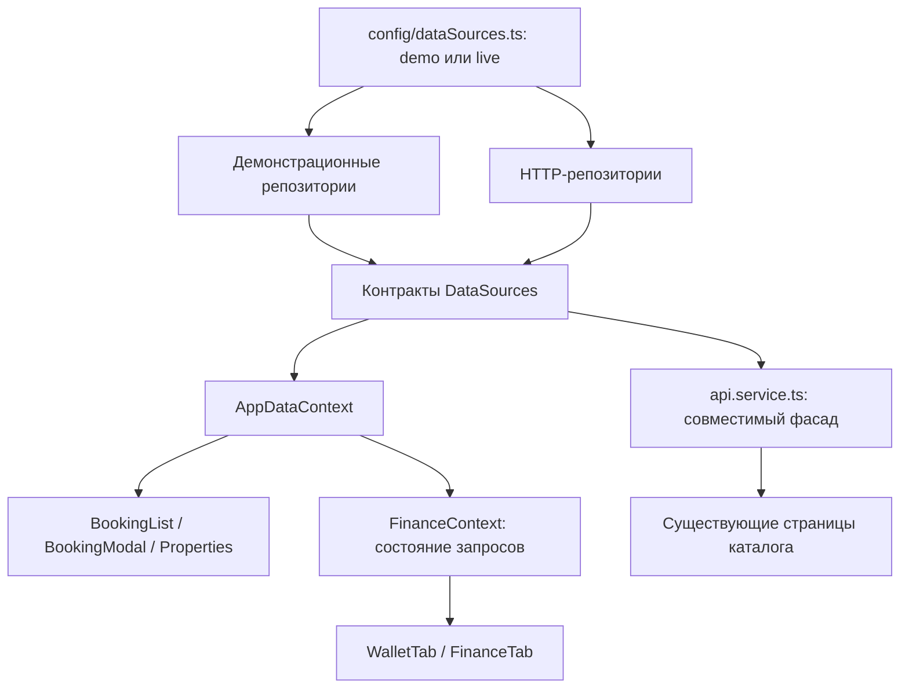

# Централизованные источники данных

## Поток зависимостей

Контекст передаёт зависимости и не содержит SQL, URL отдельных запросов,
фикстуры или расчёт баланса. `FinanceContext` отвечает за загрузку, ошибку и
защиту от повторного нажатия; репозиторий — за источник и сохранение данных.
Это разделение позволяет заменять реализацию и тестировать её независимо от React.

## Единственная точка подключения

`frontend/src/config/dataSources.ts` выбирает источник по `VITE_DATA_MODE`:

- `live`: реальные API для каталога, категорий, броней, отзывов и избранного.
- `demo`: те же методы возвращают данные из `data/demo.ts` и сохраняют изменения
  в `trailsua:demo:v1:<userId>` в localStorage. Существующие фикстуры используются
  только при первом создании демонстрационного состояния.

Режим задаётся на сборке, без переключателя для посетителя production-сайта.
Неверное значение настройки вызывает явную ошибку. Авторизация и управление
аккаунтом остаются серверными: это деморежим бизнес-данных, а не автономный вход.

Методы обоих источников асинхронны и типизированы в `data/contracts.ts`.
В компонентах нет ветвления «вызвать API или записать localStorage». Единственные
различия UI — отметка деморежима и доступность ещё не реализованных функций.

Изменение объявления автоматически уведомляет подписчиков каталога через
`withPropertyNotifications`. После смены аккаунта контексты данных монтируются
заново, чтобы не показывать состояние предыдущего пользователя.

## Границы финансового модуля

Реальные платежи, хранение карт и банковские выплаты исключены из объёма диплома.
Финансы — демонстрационная модель с явной пометкой: никакие деньги не переводятся.
В live доступно бронирование без онлайн-оплаты, финансовый репозиторий недоступен.
Контракт оставлен как пример заменяемого источника данных, но платёжная интеграция
не является обязательной незавершённой задачей этого проекта.

## Что уже переведено

- Каталог / карточка / создание и изменение жилья / кабинет владельца.
- Категории, избранное и отзывы этих страниц.
- Бронирование, расчёт, занятые даты, списки и смена статуса.
- Финансовая аналитика и кошелёк (демонстрация).
- Переписка участников бронирования; demo хранится отдельно от сервера.

Новости подключены через `DataSources.news` и используют единый статический набор
статей. Контакты, поддержка и ограничения используют `assistance`: в demo обращения
сохраняются в браузере, в live явно недоступны. Письма и обращения операторам не
отправляются, вложение хранится только как имя файла. Часть старых макетных экранов
остаётся демонстрационной. Контекст сам по себе не заменяет отсутствующее API.

## Единые настройки интерфейса

`config/locales.ts` содержит языки, локали форматирования, валюты и их отображение.
Navbar, Footer и SettingsTab строят списки из этого реестра, а состояние берут
из `SettingsContext`. Изменение видно всем подписчикам; событие `storage`
синхронизирует открытые вкладки. Неправильные сохранённые значения заменяются
безопасными значениями UA/UAH. HTML-атрибут `lang` также меняется из контекста.

Курсы валют пока фиксированные ориентировочные. Словарь перевода покрывает лишь
часть интерфейса: новый язык требует перевода строк, но не правки трёх селекторов.

## Проверки

`npm test` проверяет выбор источника, отсутствие fallback live → demo,
изоляцию пользователей, сохранение нулевого баланса и пустых списков, безопасный
сброс демоданных, контракты бронирования и уведомления каталога. Backend-тесты
проверяют реальную БД, миграции, права и конкурентное бронирование.

## Приватная переписка

`chat` входит в `DataSources`. В live идентификатором диалога служит UUID
бронирования. API требует авторизацию и проверяет GuestId либо владельца жилья
при каждом чтении и отправке. Посторонний пользователь получает 404, даже если
знает идентификатор; роль администратора сама по себе не открывает переписку.
Старые общие диалоги `c1` не переносятся: их участников нельзя надёжно установить.
История сохраняется после отмены бронирования. Новое сообщение — от 1 до 4000
символов; поле `isHost` в старом DTO теперь означает «от текущего пользователя».

Интерфейс получает диалоги из списков бронирований и сохраняет текст черновика
при ошибке отправки. Сообщение появляется только после успешного ответа
выбранного репозитория. Demo хранит сообщения отдельно по аккаунту и бронированию,
не обращаясь к chat API. Обновление ручное; вложения и realtime не реализованы.
