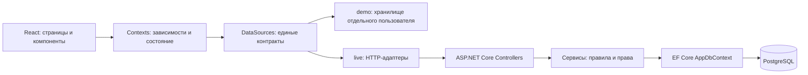
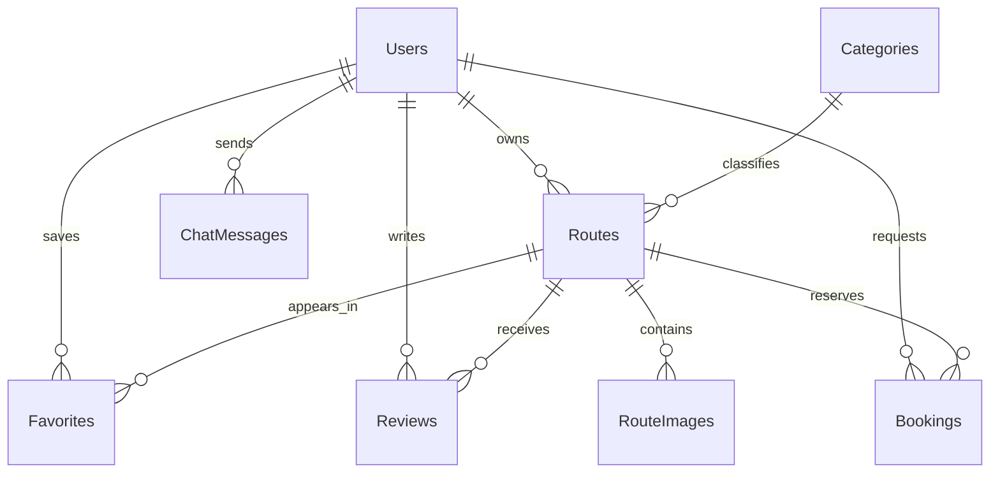

# Подготовка к защите TrailsUA

## Что демонстрирует проект

Веб-приложение поиска жилья и управления бронированиями с ролями гостя, владельца
и администратора. Основной результат — сквозной сценарий от каталога до заявки,
подтверждения владельцем и приватной переписки, с сохранением состояния в БД.
Реальные платежи и выплаты намеренно исключены из объёма работы двух разработчиков.

## Стек и назначение технологий

| Часть | Технологии | Назначение |
| --- | --- | --- |
| Frontend | React 19, TypeScript 6, Vite 8 | Компоненты, типизация, сборка SPA |
| Навигация и запросы | React Router 7, Axios 1 | URL страниц, HTTP и обновление сессии |
| Общее состояние | React Context, типизированные репозитории | Авторизация, настройки, источники данных |
| Карта | Leaflet 1.9, React Leaflet 5 | Отображение расположения |
| Backend | C#, ASP.NET Core, .NET 10 | HTTP API, авторизация, правила приложения |
| Доступ к данным | EF Core 9, Npgsql 9 | Запросы, связи, миграции PostgreSQL |
| База | PostgreSQL 16 | Долговременное хранение, транзакции и ограничения |
| Авторизация | JWT, refresh-токен, BCrypt | Сессии и хеширование паролей |
| Проверки | xUnit, SQLite, PostgreSQL, Vitest, ESLint | Бизнес-правила, интеграция и качество кода |
| Инфраструктура | Docker, GitHub Actions | База локально, CI; деплой описан в main |

Версии групп указаны по файлам проекта; точные версии frontend закреплены в
package-lock.json, backend — в csproj. Сборки .NET и EF Core имеют разные номера
версий: это не означает, что приложение использует .NET 9.

## Архитектура

В backend Domain содержит сущности и DTO, Infrastructure — сервисы и доступ к БД,
API — контроллеры, middleware и настройку приложения. Это слоистый монолит.
Контроллер админки использует DbContext напрямую; проект не следует строгой Clean
Architecture во всех модулях, и на защите не нужно утверждать обратное.

`config/dataSources.ts` выбирает demo/live. Контексты и компоненты используют
одинаковые контракты; новые интеграции подключаются через адаптер. Сам контракт
не создаёт отсутствующее API: для новой реальной функции потребуется backend.
Ошибка live API не подменяется демонстрационными данными. Авторизация всегда реальная.

`config/locales.ts` задаёт список языков/валют, `SettingsContext` хранит выбор,
Navbar/Footer/настройки подписываются на одно состояние. Переводы строк ещё неполные;
централизованное состояние и полнота перевода — разные задачи.

## Данные и ограничения

Это укрупнённая схема, а не полный список столбцов. Актуальная физическая модель —
`AppDbContext` и EF migrations. `ChatMessages.DialogId` хранит UUID бронирования
строкой; связь с участниками проверяется сервисом, отдельного FK на Booking нет.
В модели также остались Comments и другие исторические поля.

Стоимость и число ночей рассчитываются сервером, сумма сохраняется в бронировании.
Границы дат полуоткрытые: выезд одного гостя может совпадать с заездом другого.
Пересечение активных заявок запрещается PostgreSQL exclusion constraint с btree_gist:
это защищает и от двух одновременных запросов, а не только от последовательных.
Отмена/отклонение освобождает интервал. Подробности: [BOOKINGS.md](BOOKINGS.md).

## Выступление в общем 30-минутном слоте команды

Актуальная презентация всей программной части и поминутное распределение находятся
в [PREDEFENSE.md](PREDEFENSE.md). На двух программистов предложено 12 минут:
9 минут рассказа и 3 минуты демонстрации. Остальное время остаётся вступлению,
дизайнерам, DevOps и вопросам. Этот план подходит для предзащиты и защиты
после обновления фактических результатов проверок.

Подготовьте отдельные аккаунты гостя, владельца и администратора, объявление
и свободные будущие даты. Авторизуйтесь заранее и отрепетируйте показ с секундомером.

## Возможные вопросы

- **Зачем Context?** Передать общее состояние и зависимости без ручного обновления
  каждой страницы. Правила и запросы при этом остаются в сервисах/репозиториях.
- **Почему PostgreSQL?** Связи и транзакционные ограничения подходят для бронирований;
  запрет пересечений можно гарантировать на уровне БД.
- **Достаточно скрыть кнопку администратора?** Нет. API проверяет роль и конкретное
  действие; главный администратор защищён отдельно. Подробности: [ADMIN.md](ADMIN.md).
- **Что будет при двух заявках одновременно?** Ограничение БД принимает одну;
  второй запрос получает конфликт. Это проверяется интеграционным тестом.
- **Зачем demo?** Для изолированной демонстрации сценариев и проверки заменяемости
  источников. Данные разных аккаунтов и live/demo не смешиваются.
- **Как защищён чат?** На каждом запросе проверяются участники бронирования. Admin
  сам по себе не имеет доступа к чужому диалогу. Обновление ручное, без realtime.
- **Готово ли к большой коммерческой нагрузке?** Это дипломный прототип с работающим
  ядром; нагрузочные испытания, эксплуатационный мониторинг и полный security-аудит
  не проводились.

## Честные границы демонстрации

Финансы — только demo. Поддержка/обращения — demo без настоящих операторов и отправки
писем. Новости — статический контент через общий источник. Полная локализация,
проверка личности через Дію, realtime-чат, восстановление пароля письмом и отдельная
модераторская панель не заявляются как готовые. Макетные блоки не следует выдавать
за реальные показатели. Проверенные сценарии перечислены в [VERIFICATION.md](VERIFICATION.md).

Материал можно использовать как основу пояснительной записки и презентации;
оформление под требования кафедры, фамилии авторов и формальное распределение работ
нужно заполнить отдельно.
